# Homelab Setup

## Motivation

I already have a Synology NAS. docker-compose works great. But I wanted to learn more about Kubernetes too, so here I am.

## Hardware Setup

```mermaid
graph TB
    Synology[Synology NAS]

    subgraph Compute[Compute Layer]
        SSD[SSD Volume Pool] --> VM[Ubuntu VM]
        VM --> k3s[k3s Cluster]
    end

    subgraph Storage[Storage Layer]
        NAS_Storage[HDD Volume Pool]
    end

    Synology --> Compute
    Synology --> Storage
    k3s -.->|Persistent Data| NAS_Storage

    style Synology fill:#0066cc
    style k3s fill:#326ce5
    style NAS_Storage fill:#000000
```

**Infrastructure Stack:**

- **Synology NAS** - Physical hardware to host everything
- **Ubuntu VM** - Virtualization layer running k3s
- **k3s** - Lightweight Kubernetes cluster
- **NAS Storage**
  - **SSD Volume Pool** - Volume pool for hosting VM only.
  - **HDD Volume Pool** - Volume pool for any persistent data (databases, configs, media)

## Networking

This way, I can access all my services at `*.homelab.azuanz.com` from anywhere:

```mermaid
graph TB
    subgraph AtHome[At Home]
        WiFi[Local WiFi]
    end

    subgraph RemoteAccess[Remote]
        Remote[Outside Network] --> Tailscale[Tailscale VPN]
    end

    WiFi --> AdGuard
    Tailscale --> AdGuard

    subgraph K3sCluster[k3s Cluster]
        AdGuard[AdGuard Home<br/>DNS: 192.168.68.151]
        Traefik[Traefik Ingress<br/>192.168.68.153]
        Services[Services<br/>Jellyfin, Sonarr, Traefik, etc.]
    end

    AdGuard -->|Resolves to<br/>192.168.68.153| Traefik
    Traefik --> Services

    style WiFi fill:#000000
    style Tailscale fill:#4285f4
    style AdGuard fill:#000000
    style Traefik fill:#326ce5
```

### AI Assistants

- Mainly using Claude Code, occasionally using Codex
